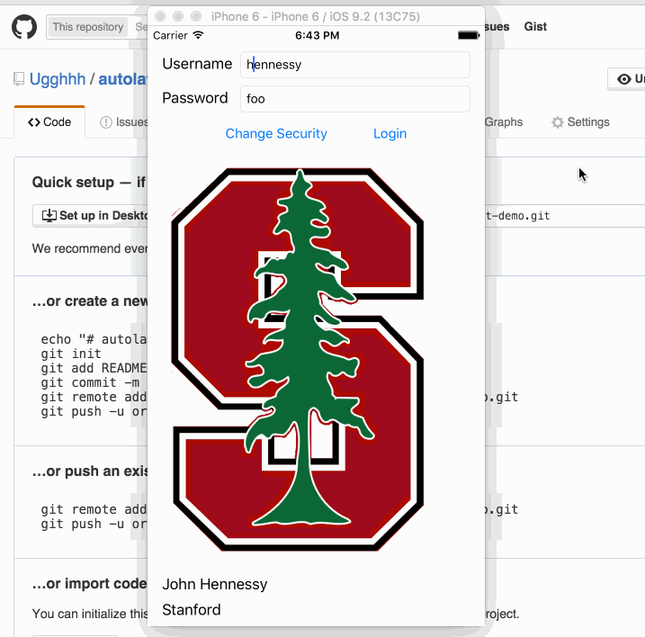

# Autolayout Demo
Shows some things in autolayout; most of it not in code but done in storyboard.

## Notes
  * A tip with autolayout is to use the constraint inspector to see if there are any "magic values."  If there is, set them all back to standard value (or if that isn't possible, 0).
  * Constraint inspector also allows for customizing alignment constraints (example: lining up a center edge to a bottom edge).
  * Since it is common for landscape orientation to have a completely different button/label/etc. layout vs. portrait, one can go in the bottom of the storyboard and customize layouts for each different situation.
    * The main ones are: (Compact Width, Compact Height), (Compact Width, X), (X, Regular Height), and (Regular Width, Regular Height).  The latter being iPads only essentially, and the former are more common cases for iPhones.
  * Images are tricky because they want to push everything out of the way so constraints need to be set carefully.
    * In particular, they should have a lower hugging priority and a lower compression priority.  The former makes it so that if anybody needs to stretch, they would be the one to stretch first.  The latter makes it so that if anyone needs to be compressed, the image would be compressed first.
  * Images don't look good outside of their intended aspect ratio.  The only way to preserve aspect ratio is in code because Autolayout cannot possibly tell what images you are going to load in there.
    * The way to do this is through `NSLayoutConstraint`.  Once the constraint is created, add it to the storyboard with `view.addConstraint` and remove it (during reloads, you want to remove old constraints to prevent a ton of unused constraints) with `view.removeConstraint`.

## Demo
The demo here mostly shows the feature in storyboard where you can rearrange UI elements when the rotation changes.

